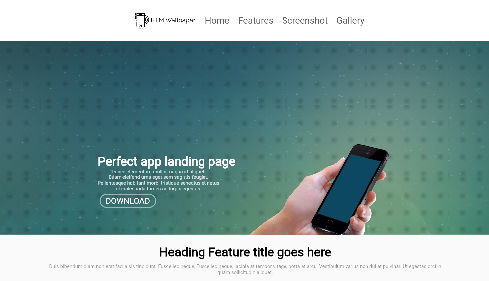
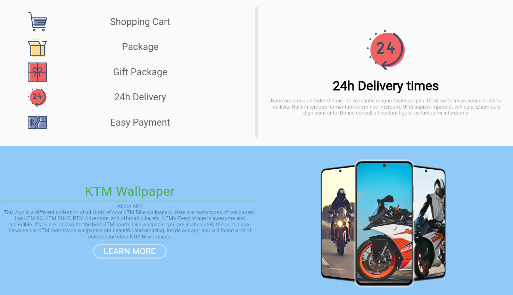
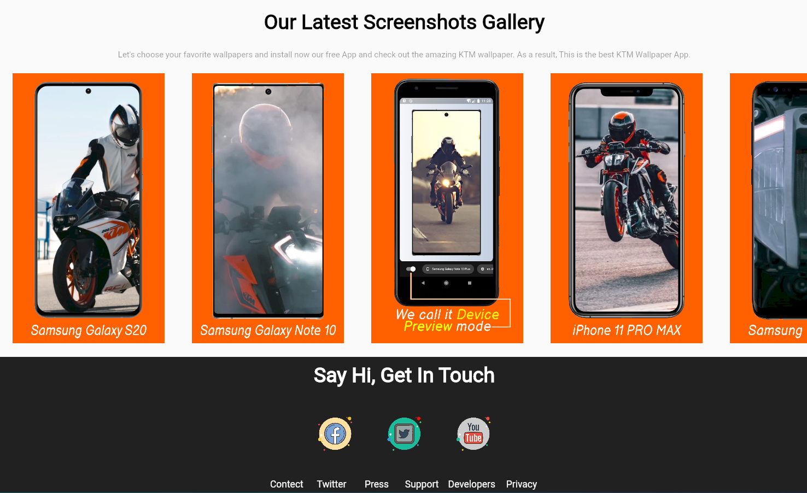

## before clone the GitHub repository please give a star on the repository.

I am trying to teach Responsive Ui design. This video for Web and Mobile. This design is suitable for Desktop, Tab, and Mobile platforms.

### Link to the tutorial: https://youtu.be/42b_XmUB3yg
##
### Web Screenshots
 
 
 
  
 
##
### Mobile Screenshots

 
 
   
   
     
 
 

